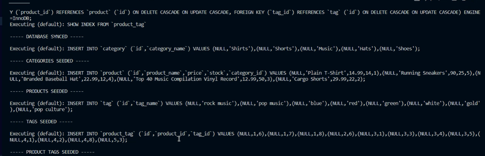
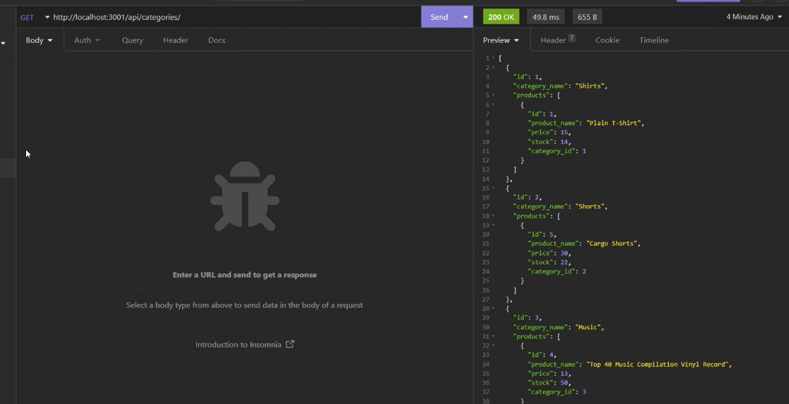
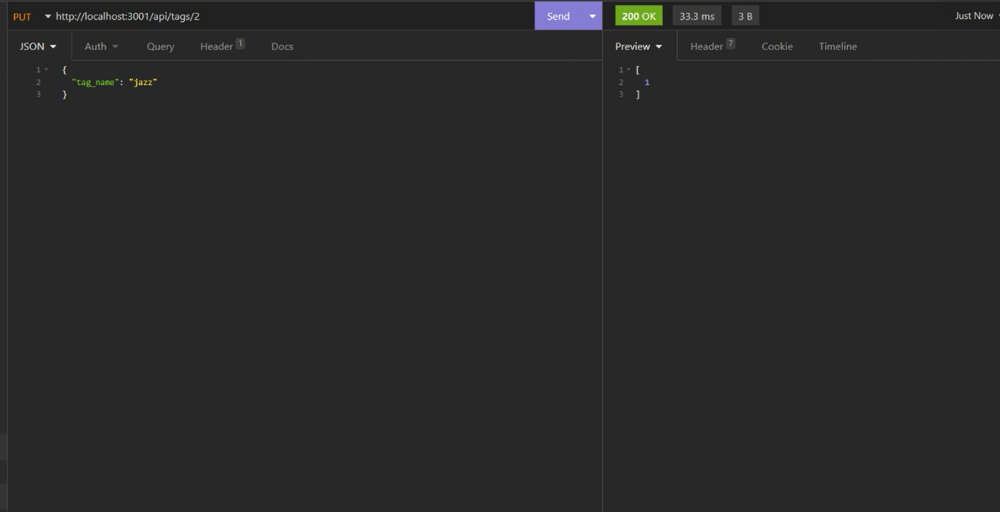
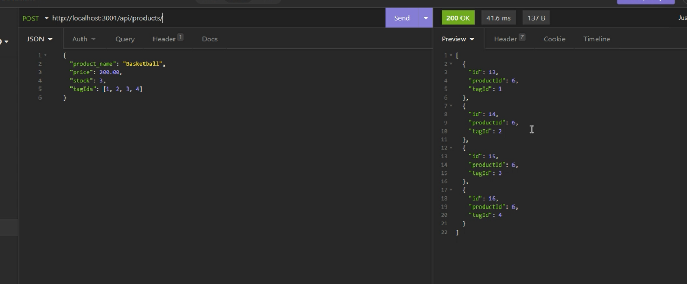
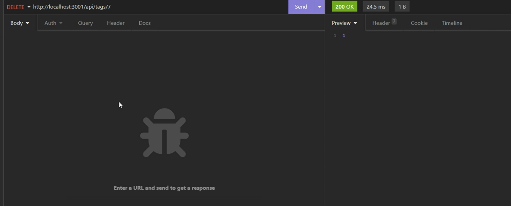

# Hw13-E-CommerceBackEnd

### This is Mikhail Sookwah's of creating the back end of a commerce application

This program includes: 

* A Databased consisting of Category, Product, Tag and Product-Tag tables

    * All four Tables are pre-seeded with data

    * The ability to add, view, update and delete data on each table

----------------------------------------------------------------

[Link to the website](https://github.com/Mikhail25/Hw13-E-CommerceBackEnd)

[Link to the instruction video](https://drive.google.com/file/d/1smM85LmoAy_ocBXybm0JieuaXiqtvEv3/view)